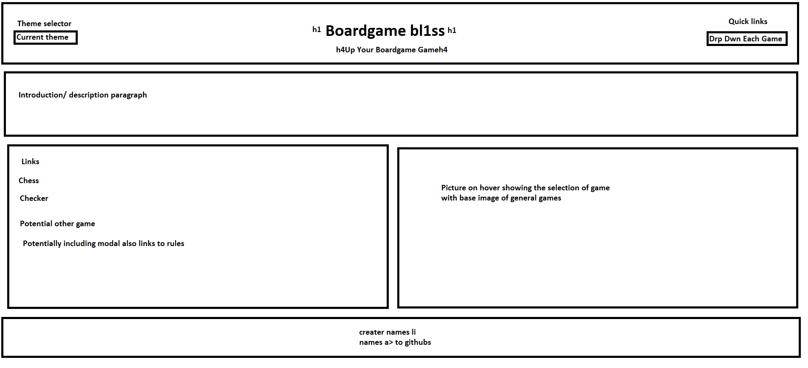

# Boardgame Bliss

## Link & Contents
- [The Deployed Page](https://awesome-foursome.github.io/boardgame-bliss/)
- [Further Goals](#further-goals)
- [Potential Issues/Improvements](#potential-issuesimprovements)
- [Key Learnings](#key-learnings)
- [Contributing and Feedback](#contributing-and-feedback)
- [Credits](#credits)
- [Licence](#licence)

## The Project

This page was designed for a user to be able to input the chess board state from games on Chess.com. The user then receives a suggested move and an indicator on the current state of the game as provided by the Stockfish Api. If the user is just starting out then they can access the rules page in order to receive a detailed breakdown on the obect of the game, how pieces move, other rules and introductory videos. 
Other features include:
- Saving various data to local storage for quick future access.
- An interactive GUI including modals, hover effects and themes.
- Disclaimers to prevent automatic access to sections of content.

Goals included, having pages function without errors, consistent appearance throughout and using a third party css library for the bulk of styling.

- [The Deployed Page](https://awesome-foursome.github.io/boardgame-bliss/)

## Further Goals

Other goals include:
- The implementation of an effective Agile team environment.
- Effective task delegation through Github projects.
- Writing a good README.
- Ensuring commenting is folowing best practices and in place for ease of future alteration.
- Have all elements of the page semantic where practical.

## Potential Issues/Improvements

- Condensing some of the code. To ensure easy readability for other contributors.
- Increased scope to add functionality for additional games.
- Additional pages and features.
- Trying to convert code to be uniform and follow best practices.

## Key Learnings

The biggest learning points and hurdles we faced were around initial project planning and communication between members on goals/direction.

Other learnings include:
- Working in an Agile environment.
- Dealing with merge conflicts.
- Better understanding on which components of work impact others and how.
- Effective use of other team members existing code.

## Contributing and Feedback

If you find any issues or have contributions or feedback you can do so by opening an [issue](https://github.com/awesome-foursome/boardgame-bliss/issues) on Github.

## Credits

Group introduced and partnered together by edX/Monash University.

Made use of the Xpert learning assistant, AskBcs and our instructor with troubleshooting issues.

[Chess.com](https://www.chess.com) for providing the third party API containing game state.

[Stockfish](https://stockfish.online) for providing the third party API with suggested moves.

Images are from the following sources:
- Tima Miroshnichenko: https://www.pexels.com/photo/person-reading-book-on-table-beside-chess-game-10626014/
- https://commons.wikimedia.org/wiki/File:Chess_Banner.jpg
- https://commons.wikimedia.org/wiki/File:Board_Games_in_North_America_01.JPG
- Cristian V.'s photo, licensed as Attribution-NoDerivs: https://www.flickr.com/photos/shyald/409601105

Videos are from:

## Licence

MIT License

Copyright (c) 2024 Simon Brown
