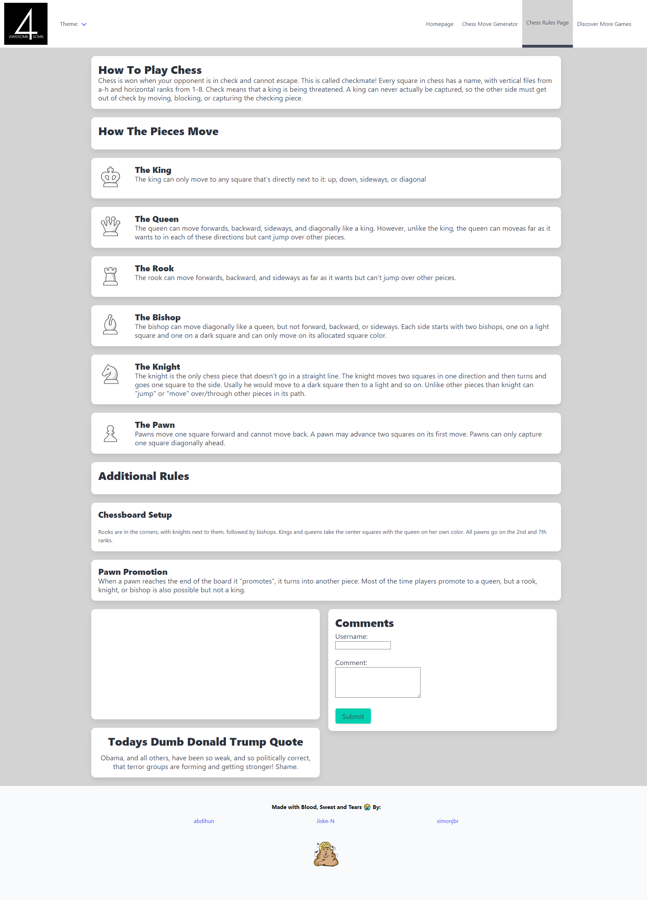

# Boardgame Bliss

## Link & Contents
- [The Deployed Page](https://awesome-foursome.github.io/boardgame-bliss/)
- [Further Goals](#further-goals)
- [Potential Issues/Improvements](#potential-issuesimprovements)
- [Key Learnings](#key-learnings)
- [Contributing and Feedback](#contributing-and-feedback)
- [Credits](#credits)
- [Licence](#licence)

## The Project

This page was designed for a user to be able to input a Chess.com username in order to recieve a best move (as calculated by the stockfish engine) for all of the ongoing `Daily Games` associated with that username. The user can also control the `Depth` (1 - 15) of the calculations (the number of moves into the future to be considered). Other data is presented to the user including:
- An alternative move to `ponder`
- The URL of the ongoing game as a working link
- A potential `Continuation` given the `Best Move` is made
- An `Evaluation` of the game as it is (positive values favour white's position, negative values favour black's)
- If a forced `Mate` is available the user is told how many moves it will take (positive values for white's checkmate, negative values for black). This will be `null` if not mate is available

If the user is just starting out then they can access the rules page in order to receive a detailed breakdown on the obect of the game, how pieces move, other rules and introductory videos. 

If the user wants to discover more board games they can also use the discover more games page to generate lists with various suggestions and popular trends. List items also link to external sources providing additional information about the games.

Goals included, having pages function without errors, consistent appearance throughout and using a third party css library for the bulk of styling.

Other features include:
- Saving various data to local storage for quick future access.
- An interactive GUI including modals, hover effects and themes.
- Disclaimers to prevent automatic access to sections of content.

## Homepage

## Chess Move Generator

## Chess Rules Page

## Discover More Games

- [The Deployed Page](https://awesome-foursome.github.io/boardgame-bliss/)

## Further Goals

Other goals include:
- The implementation of an effective Agile team environment.
- Effective task delegation through Github projects.
- Writing a good README.
- Ensuring commenting is folowing best practices and in place for ease of future alteration.
- Have all elements of the page semantic where practical.
- Add access to other chess websites such as lichess.org.
- Add alternative chess engine options.
- Display images in results cards of the chess boards updated with the best move.

## Potential Issues/Improvements

- Condensing some of the code. To ensure easy readability for other contributors.
- Increased scope to add functionality for additional games.
- Additional pages and features.
- Trying to convert code to be uniform and follow best practices.

## Key Learnings

The biggest learning points and hurdles we faced were around initial project planning and communication between members on goals/direction.

Other learnings include:
- Working in an Agile environment.
- Dealing with merge conflicts.
- Better understanding on which components of work impact others and how.
- Effective use of other team members existing code.
- The necessity of standardised indentation.

## Contributing and Feedback

If you find any issues or have contributions or feedback you can do so by opening an [issue](https://github.com/awesome-foursome/boardgame-bliss/issues) on Github.

## Credits

Group introduced and partnered together by edX/Monash University.

Made use of the Xpert learning assistant, AskBcs and our instructor with troubleshooting issues.

[Chess.com](https://www.chess.com) for providing the third party API containing game state.

[Stockfish](https://stockfish.online) for providing the third party API with suggested moves.

[BGG](https://boardgamegeek.com) for providing the third party APIs with content on games.

[Tronald Dump](https://www.tronalddump.io) for providing the third party API with dump quotes.

[Net Ninja](https://www.youtube.com/@NetNinja) for Bulma CSS tutorial.

[Bulma CSS](https://bulma.io/) for providing the CSS framework.

[jQuery](https://jquery.com/) for providing the JavaScript Library.

Images are from the following sources:
- Tima Miroshnichenko: https://www.pexels.com/photo/person-reading-book-on-table-beside-chess-game-10626014/
- https://commons.wikimedia.org/wiki/File:Chess_Banner.jpg
- Cristian V.'s photo, licensed as Attribution-NoDerivs: https://www.flickr.com/photos/shyald/409601105
- https://chess.fandom.com/wiki/Main_Page
- https://commons.wikimedia.org/wiki/File:Board_Games_for_Family_Fun.png - index-default
- https://www.pexels.com/photo/black-and-gray-dice-on-white-board-game-7150646/ - other-games-link
- https://www.flickr.com/photos/sidkid/6921601618/in/photostream/ - other-games
- https://m.facebook.com/atawesomefoursome

Video is from:
- Chess.com on youtube https://www.youtube.com/watch?v=S5GIpAM-aWQ&t=7s

## Licence

MIT License

Copyright (c) 2024 Simon Brown
